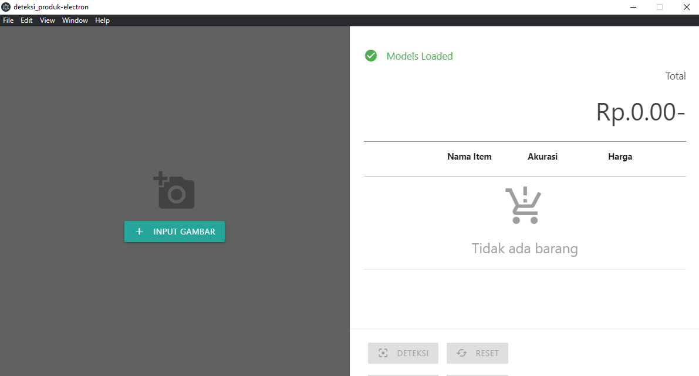
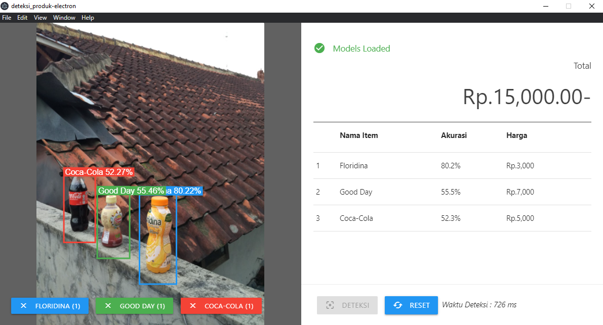
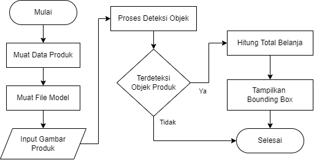

# Deteksi Produk

## Framework
- [Vue Js](https://vuejs.org)
- [Materialize CSS](https://materializecss.com/)
- [Electron Js](https://www.electronjs.org/)

## Screenshoot

### Tampilan Halaman Deteksi

### Tampilan Hasil Deteksi


## Flowchart Proses Deteksi


## Training Model
[object_detection_training.ipynb](https://gist.github.com/nazililham11/f65690eb39670f37cfb15793dee99bcb)


## Project setup
```
npm install
```

### Compile untuk development
```
npm run electron:serve
```

### Compile untuk production
```
npm run electron:build
```
